## 基于大规模日志的故障诊断（**第三届阿里云磐久智维算法大赛**）

### 成员

- 郭镇远（3220211009）
- 王    昊（3120211043）
- 陈紫涵（3220210994）
- 桑子玉（3220211060）

### GitHub地址

https://github.com/Relwayg/TianChi

### 1. 问题提出

#### 1.1 问题背景及分析

**背景：基于大规模日志的故障诊断（第三届阿里云磐久智维算法大赛）**

在大规模IT设备、应用运维过程中，故障的发生无可避免，而服务器日志数据是技术人员对大规模设备排查根因的关键。而面对大规模复杂无序的日志数据，很难直接进行分析，得到可靠的结论。因此近年来围绕日志分析，涌现出了众多的先进技术，不断突破了技术瓶颈，为运维人员对日志的分析提供了可靠武器。

比赛为我们提供了大量的不同类别的服务器运行日志，这些日志反映了服务器运行过程中各类部件的状态，能够在服务器故障时用来快速的定位出故障所在，这对于高效的修复故障、避免维修时间的浪费、降低服务器更换成本，提高用户使用体验都至关重要，但准确的识别出故障根因并不是容易的事情，需要多种数据分析技术进行处理，因此这个问题富有挑战性。

**分析：根据一段时间的系统日志数据，诊断出服务器发生了那种故障**

根据阿里云提供的服务器日志数据集，利用各种的数据挖掘算法构建出故障相关的特征，并采用合适的机器学习算法予以训练，最终的到可以区分故障类型的最优模型。

赛题数据主要给了服务器的日志时间和告警类型，其中告警类型有4种，因此可以简单的看成是一个简单四分类问题，关键在于如何根据告警的数据构建出故障的相关特征，初步分析我们尝试使用word2vec+tf_idf算法进行特征提取特征，使用CatBoost算法作为分类模型。

#### 1.2 数据描述

> **数据来源：** 第三届阿里云磐久智维算法大赛基于大规模日志的故障诊断
> **数据网址：** https://tianchi.aliyun.com/competition/entrance/531947/information

**数据主要分为两种类型**

- SEL日志数据
- 训练标签数据

##### 1.2.1 SEL日志数据

Table1: SEL日志数据，主要包含日志信息

| Field        | Type   | Description          |
| ------------ | ------ | -------------------- |
| sn           | string | server serial number |
| time         | string | log reported time    |
| msg          | string | log                  |
| server_model | string | server model         |

其中包含了四个字段信息

1. **sn**: 表示服务器的id信息，eg: SERVER_30000、SERVER_30001....
2. **time**: 表示产生日志的时间，eg: 2020-10-13 03:06:01
3. **msg**: 表示日志信息，反映了当前时间该服务器发生了哪些事件信息， eg: Memory Memory_Status | Correctable ECC | Asserted
4. **server_model**: 表示服务器端正在运行的模型， eg: SM101,SM125,SM154....

##### 1.2.2 训练标签数据

Table2：训练标签数据，包含日志数据对应的告警类型标签

| Field      | Type   | Description                     |
| ---------- | ------ | ------------------------------- |
| sn         | string | server_seial_namber             |
| fault_time | sting  | fault tme of server             |
| label      | int    | failure label: 0,1,2,3 四种故障 |

其中包含了三个字段信息

1. **sn**: 表示服务器的id信息，eg: SERVER_30000、SERVER_30001....
2. **fault_time**: 表示服务器发生故障的时间，eg: 2020-10-13 03:06:01
3. **label**: 表示发生的故障类型，总共四种，分别是：CPU故障1、CPU故障2、内存故障和其他故障

##### 1.2.3 所有数据文件

比赛总共提供了8个文件：

SEL日志文件: 包含了训练用的日志文件和A榜B榜的训练日志文件

- preliminary_sel_log_dataset.csv
- additional_sel_log_dataset.csv
- preliminary_sel_log_dataset_a.csv
- preliminary_sel_log_dataset_b.csv

训练标签文件: 包含了训练用的进行标注的训练文件，A榜B榜用于提交未标注的预测文件

- preliminary_submit_dataset_a.csv
- preliminary_submit_dataset_b.csv
- preliminary_train_label_dataset_s.csv
- preliminary_train_label_dataset.csv

  其中可用于训练SEL日志总数: 1237330 条 用于训练的标签数据总数: 16669 条

  可以看到我们选取的数据量十分巨大，并且msg字段存在很多特殊情况需要处理

#### 1.3 初步思路

##### 1.3.1 准备采用的方法或模型

特征提取：使用word2vec、类别统计、词频统计来提取告警特征

模型选择：CatBoost决策树模型、GRU神经网络模型

##### 1.3.2 预期的挖掘结果

能够根据一段时间内的日志数据推理出发生的故障原因

### 2 数据预处理

我们的数据并不涉及到缺失值，因此没有使用缺失值处理，主要集中在对SEL日志的模版构建，以及冗余日志的处理，本节将详细阐述我们对数据分析的过程，以及对不同的日志数据方法，主要涉及了drain3、冗余处理、构造日志事件等

#### 2.1 数据分析处理

对数据进行初步的分析，根据我们模型需要的数据格式对数据进行初步处理

##### 2.1.1 SEL日志预处理

**分析：**  SEL日志信息虽然相对来说比较规整，但是还是存在着很多问题，同类型的SEL日志由于对设备的中硬件的命名不同从而产生不同的日志，这些是需要我们进行处理，产生相同类型模版。

**处理：** 这里我们使用drain3和正则表达两种不同的方式进行处理，最后认为正则表达式处理效果较好

1. 使用drian3进行处理drian3是一个专门处理日志数据的开源库模版，可以将服务器的SEL日志转换成模板，从而对日志数据进行分析，可以大大的减少分析日志时候的复杂程度。drian3中的模版都是提前构建好的，适用于大多数的SEL日志情况，但是，对于特定的日志情况并不适用，因此我们需要对其进一步的处理。
2. 使用自己构建的正则表达式处理 通过使用正则表达式的方式，我们可以重新自定义需要匹配的SEL日志类型，从而可以对SEL数据进行一次清洗，主要清洗的部分由以下几个方面： a.  对错误的日志字符进行处理：在我们分析的过程中，发现了大量的错误的字符以及乱码信息，这些可以通过我们的正则表达式进行剔除 b.  对相同类型的字段进行处理：SEL数据中存在着大量的相同类型的字段，例如：CPU0，CPU1，CPU2等，这些数字明显对我们的告警分类没有作用，因此我们通过正则表达式的方式，将其全部转变成为CPUnum的形式，从而大大减少告警类型数量。

**结果：**
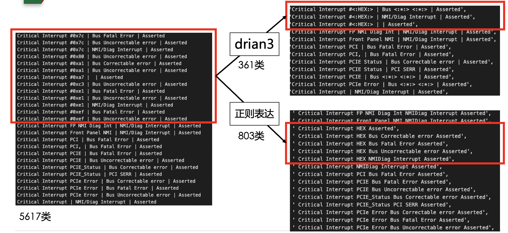
可以看到虽然drain3处理后数据类型较少，但是会缺少很多细节上的信息，因此最后我们选择的处理方式为正则表达式处理，最后我们将原有的**5617**种SEL日志类型转变成了**803**种SEL日志类型，可以看到我们的工作大大减少了日志分析的难度。

##### 2.1.2 去除冗余数据

**分析：** 在同一个时间段中会出现大量相同的SEL日志数据，因此我们需要将这些大量的相同的SEL日志数据进行剔除。

**处理：** 这里我们使用了时间阈值分片的方式进行处理，过程如下：

1. 首先将Table2（训练标签数据）根据sn进行分组，使用pandas种groupby功能，从而获得了相同sn的不同的错误发生时间（fault_time）
2. 将一个sn错误发生时间定为阈值，如果这个阈值内相同的SEL日志可以视为是冗余的日志，进行剔除处理

**结果：** 通过冗余剔除，我们将**1215210**条SEL数据通过我们的冗余去除方法收敛到了**70321**，收敛了将近**17**倍

##### 2.1.3 构建告警事件

**分析：** 一个标签数据并不是由一条SEL日志组成的，而是由多条SEL日志信息组合在一起从而构成了一个告警事件，这里我们将多条SEL日志组合在一起形成了告警事件。

**处理：** 这里同样适用时间阈值的方式进行处理，过程如下:

1. 首先将Table2（训练标签数据）根据sn进行分组，使用pandas种groupby功能，从而获得了相同sn的不同的错误发生时间（fault_time）
2. 根据错误发生的时间，设置阈值，将阈值内的SEL数据构建成一条告警事件

**结果：** 我们构建的告警事件格式如下表：

| Field      | Type   | Description                     |
| ---------- | ------ | ------------------------------- |
| sn         | string | server_seial_namber             |
| fault_time | sting  | fault tme of server             |
| label      | int    | failure label: 0,1,2,3 四种故障 |
| text       | string | 多条SEL日志，表示一种告警事件   |

数据预处理前的数据：

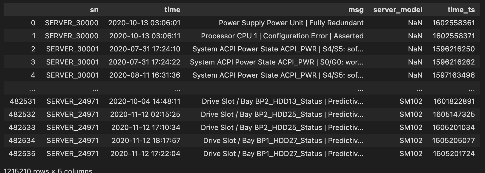

数据预处理后的数据：
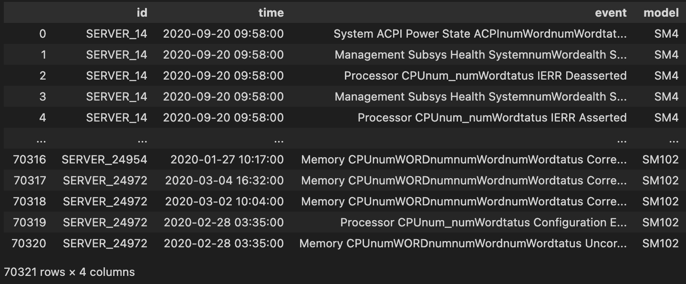

### 3 模型探索与描述

本节将详细阐述初步对数据进行的分析、模型探索的过程、以及模型的选择原因

#### 3.1 初步数据探索分析

由于数据中包含了server model、SEL日志和时间三个属性，因此本小节针对这三个属性进行探索性分析

##### 3.1.1 server_model与错误类型的关系

这里我们直接统计一下不同的server_model中发生的错误类型数量，来进行大致的判断是否与错误类型有关系

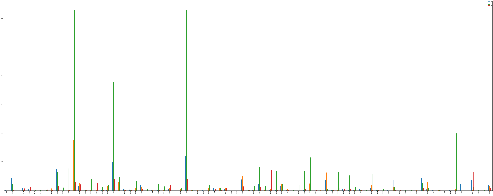

**分析：** 根据图标内容我们可以发现不同的server_model对应的错误类型并不是均匀的分布，大部分的server_model中对存在1-2个主要的错误类型，所以可以说明不同的server_model对错误的情况是具有很大的影响。

##### 3.1.2 SEL日志类型与错误类型的关系

这里我们粗劣的将SEL的首个字符作为我们的日志类型进行分析，我们首先提取了**39**种日志类型，之后绘制日志类型与错误之间的统计关系

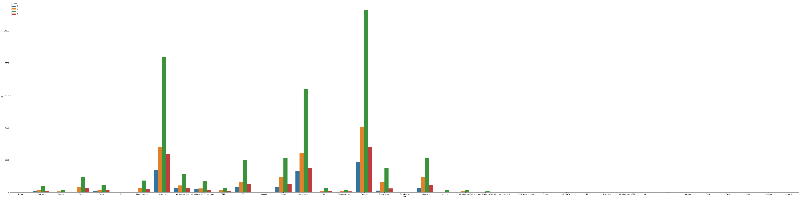

**分析：** 通过图表我们可以得到俩个信息：

1. 日志类型与错误类型是存在关系的，例如后面的CableInerconnectResserved直接可以判断出错误类型
2. 不同类型之间的标签分布是不均匀的，大部分的训练类型的标签都是第三种错误，存在数据不均匀的情况。

##### 3.1.3 时间与错误类型之间关系

这里我们想了解时间与错误类型之间的关系，我们绘制了时间与错误类型的折线图

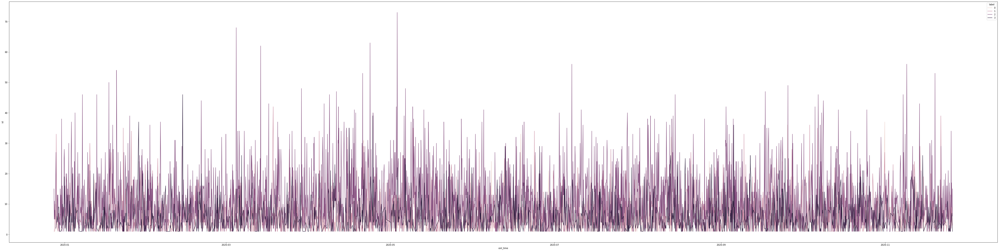

**分析：** 我们可以观测到，时间与错误类型之间并没有很强的相关性的关系，因此可以认为这个维度的数据对我们的分类并不产生影响。

**结论** 通过对3.1.1、3.1.2和3.1.3的分析，我们初步可以认定与错误类型有关系的是SEL日志的类型与server_model的类型，所以后续的分析我们主要通过对这两个维度属性进行特征的构建。

#### 3.2 特征构建

由于server model和SEL日志数据都是文本特征，无法直接放入模型进行训练，因此我们对文本特征进行了提取，这里我么将详细介绍我们的两种特征提取方式。

##### 3.2.1 word2vec提取特征

为了将文本转换成特征，最容易想到的就是使用word2vec的方式，首先我们使用了这种方式进行了尝试

**分析：** 之所以不适用onehot编码方式的原因是word2vec可以更好的反映出两个词之间的相似情况，相似的词的向量之间更为相似。

word2vec中主要有两种模型：

- 跳字模型（skip-gram）：使用当前词来预测上下文
- 连续词袋模型（CBOW，continuous bag of words）：使用上下文来预测当前词

本实验中主要选取了跳字模型，因为本场景下使用当前词来预测后续词更为准确一些

**提取流程图**
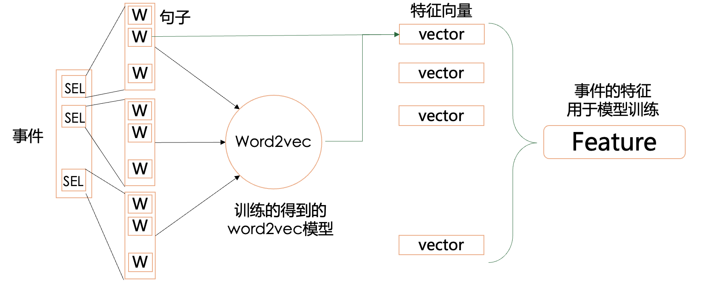

##### 3.2.2 词频统计提取特征

词频统计构建特征时候不考虑词之间的相似性，将每个单词都作为一个特征，来统计一条数据中单词出现的次数来作为我们的特征向量。

**分析：** 之所以这样选择，因为我们认为SEL日志中的单词都具有说明性意义，某个单词的出现就会对应着某种错误类型的出现，所以统计词频也是一种很有效的特征构建方式，后续的实验结果也证明了词频统计的有效性。

实验中我们将所有出现的单词和服务器模型作为属性，统计属性在一条数据中出现的次数，从而构建特征向量用于模型的训练。

**提取流程图**
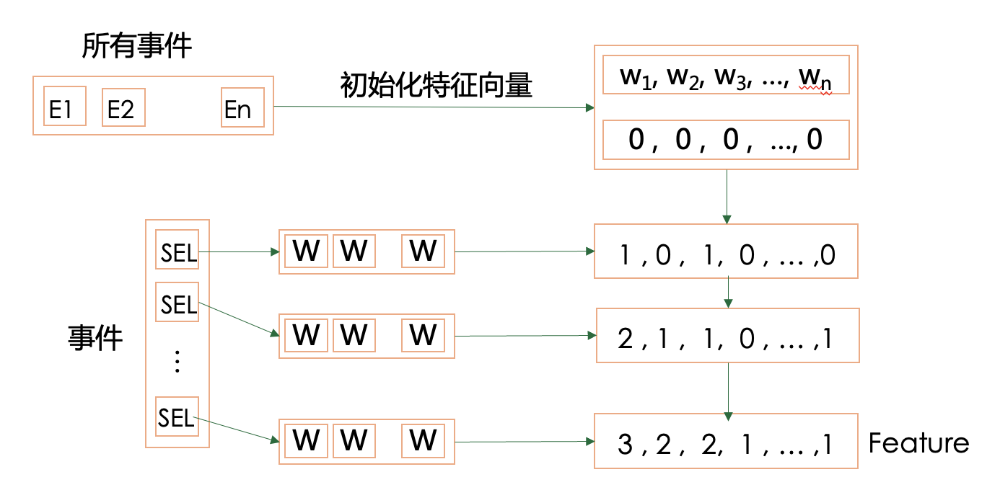

#### 3.3 模型探索

本节我们将详细阐述我们探索的两种不同的模型：传统决策树模型和神经网络模型

##### 3.3.1 初步分析

我们可以将这个问题抽象成四分类问题，如何根据一系列的SEL日志内容来进行准确的分类，是一个有监督的分类任务。

我们的模型选择可以分为两种：一个是传统的决策树模型，使用最新的CatBoost算法；另外一种是使用神经网络的方法，使用较为流行的GRU网络。

**结果：** 当前我们的结果表明这个问题比较适合于传统树模型的方案。

##### 3.3.2 CatBoost模型

**介绍**
CatBoost是2017年的开源机器学习库，属于集成学习Boosting族算法中的一种，是对GBDT算法的一种改进的决策树模型。其能够高效合理的处理：类别特征，梯度偏差，与预测偏移问题，提高算法的泛化能力。

**分析**
CatBoost是一个基于决策树的梯度提升算法，之所以选取这个方法，一方面因为我们是一个分类任务，并且特征的提取比较符合树分类模型，另一方面我们的数据中包含了server model这个类别特征，而CatBoost中的ordered TS编码可以更好的处理类别型特征。后续的实验也证明了算法的可用性。

**CatBoost使用**

- CatBoost基学习器：使用完全对称的二叉树，能够准确的避免过拟合问题，增加可靠性，提高预测速度
- CatBoost树分裂策略：便利所有候选特征及分裂阈值，选择目标函数最小的分裂阈值
- CatBoost目标函数：使用余弦相似度，wi表示样本权重，起到样本抽样效果，ai表示样本在树上的输出值，gi表示节点中样本的梯度向量，公式如下

$$
\text { Cosine }=\frac{\sum w_{i} \cdot a_{i} \cdot g_{i}}{\sqrt{\sum w_{i} a_{i}^{2}} \cdot \sqrt{\sum w_{i} g_{i}^{2}}}
$$

**CatBoost决策树生成过程**

1. 特征构建：将Server model变量使用Ordered TS编码方式进行编码，SEL事件使用特征构建进行编码生成可训练特征
2. 产生样本随机序列
3. 根据随机序列构建树的结构，使用目标函数来对特征进行分裂，计算其阈值
4. 重复23完成所有树的分裂
5. 计算叶子结点值的损失,根据损失进行下轮训练
6. 重复2-5多次直到收敛

流程图如下
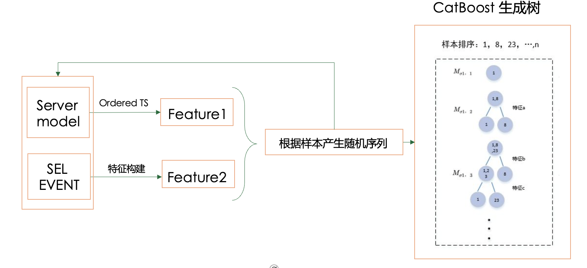

##### 3.3.2 GRU网络模型

**介绍**
GRU（Gate Recurrent Unit）是循环神经网络的一种。和LSTM（Long-Short Term Memory）一样，也是为了解决长期记忆和反向传播中的梯度等问题而提出来的

**分析**
在系统故障发生时，导致故障的原因可能隐藏在历史的日志信息里，而并非一瞬间发生的，因此我们选择使用RNN系列的神经网络来提取历史信息。RNN可以用来解决序列问题，其可以提取数据中的先后顺序信息，借助记忆单元来存储信息。RNN的数学基础可以认为是马尔科夫链，认为后续的值是有前者和一些参数的概率决定的。在原始RNN随时间进行反向传播的过程中，梯度的连乘很容易导致发生梯度爆炸和梯度消失，因此RNN有了很多变种，GRU就是其中一种轻量化的模型。

在原始RNN随时间进行反向传播的过程中，梯度的连乘很容易导致发生梯度爆炸和梯度消失，因此RNN有了很多变种，由于本数据集数量较少，经典的LSTM模型可能会存在收敛问题，我们选择了RNN中一种轻量化的模型GRU来进行训练

**GRU使用**
GRU的结构如下，主要包含重置门和更新门，把GRU看成LSTM的变体，相当于取消了LSTM中的cell state，只使用了hidden state,并且使用update  gate更新门来替换LSTM中的输入们和遗忘门，取消了LSTM中的输出门，新增了reset  gate重置门。这样做的好处是在达到LSTM相近的效果下，GRU参数更少，训练的计算开销更小，训练速度更快。

其中计算公式如下：

$$
z_t =\sigma(W_z·[h_{t-1},X_t ])
$$

$$
r_T =\sigma(W_r·[h_{t-1},x_t])
$$

$$
\hat{h_t}=tanh(W·[r_t*h_{t-1},x_t])
$$

$$
h_t =(1-z_t)*h_{t-1}+z_t*\hat{h_t}
$$

**图例**
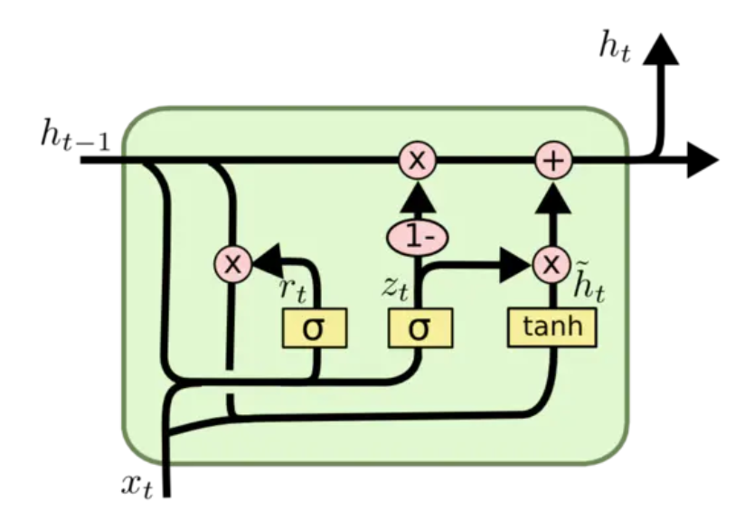

### 4 实验部分

本节我们对第3节中两种特征提取方式和两种模型都做了对比实验，并选取了实验效果最好的部分作为提交结果。

**当前天池排名：81/1758（前100进入复赛）**
**最好组合：词频特征+CatBoost模型**

#### 4.1 评价标准

为了与天池比赛保持一致，这里我们使用与比赛相同的的加权F1来对算法进行评估

**Precision** = TP / （TP + FP）

**Recall** = TP / （TP + FN）

**F1** = ( 2 x Precision x Recall ) / ( Precision + Recall )

**wi** = { 3/7, 2/7, 1/7, 1/7 }

**Macro F1** = sum(wi x F1-scorei)

#### 4.2 实验设置

本节详细展示了我们实验过程中所用的参数设置情况

**数据划分与交叉验证**
我们的数据划分使用了sklearn库中提供的GroupKFold进行K折交叉验证，从而实现了训练数据与测试数据的划分和交叉验证同时进行

**Word2Vec的参数设置**

| 参数名    | 参数值 |
| --------- | ------ |
| 特征长度  | 100    |
| 窗口大小  | 3      |
| skip-gram | TRUE   |
| 迭代次数  | 20     |

**CatBoost参数设置**

| 参数名       | 参数值    |
| ------------ | --------- |
| 学习率       | 0.05      |
| 最大树数     | 2000      |
| 树深         | 10        |
| 损失函数     | 交叉熵    |
| 叶子梯度步数 | 8         |
| 权重计算逻辑 | Bernoulli |

**GRU参数设置**

| 参数名   | 参数值           |
| -------- | :--------------- |
| 学习率   | 1e-4             |
| 迭代次数 | 300              |
| 网络结构 | GRU/LSTM/RNN+MLP |
| 损失函数 | 交叉熵           |

#### 4.2 CatBoost实验过程

我们对Catboost进行了5折交叉验证进行训练，下图就是我们训练过程中目标函数的变化过程，其中实线表示测试集合目标函数变化，虚线表示训练集合目标函数变化，不同颜色代表不同的折交叉验证
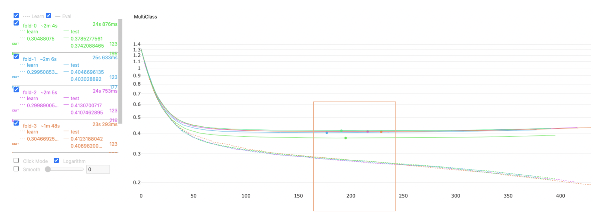
**结论：** 我们发现当训练到200轮时候测试集合已经达到最优，接下来训练会导致模型过拟合，因此我们只选用最优的验证集模型作为我们最终的模型用于结果的提交。

之后我们对特征重要性进行了统计，如下图所示
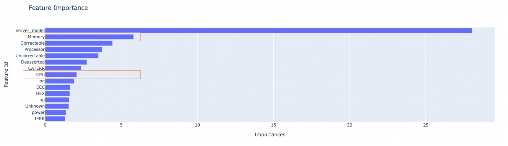
**结论：** 通过分析发现其中Memory和CPU所占重要性较高，与我们的错误类型很接近（0-1表示CPU错误，2表示内存错误，3表示其他错误），说明我们挖掘的内容是有意义的

#### 4.3 GRU实验过程

GRU实验过程中对比三种变种网络性能，蓝色、橙色和绿色线条分别是CRU，LSTM，RNN三种网络，其中有正确率，F1，损失变化情况
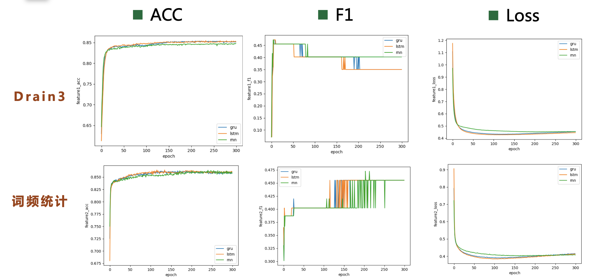
**分析：** 我们发现随着训练轮数增加，模型会逐渐收敛，但是使用Drain3提取特征的方式的F1值会逐渐下降，其原因是发生了过拟合现象，而词频统计方法则不会产生过拟合现象，可以认为词频统计的特征提取方式更适合与GRU网络模型

#### 4.4 实验结论

我们最终的实验结果对比图如下表所示，其中表格中的值是我们的评价标准

| 特征提取方式/模型 | CatBoost | GRU    |
| ----------------- | -------- | ------ |
| word2vec/drain3   | 0.3661   | 0.4021 |
| 词频统计          | 0.6118   | 0.4554 |

**结论：** 通过对表格数以及实验结果的分析我们可以得到以下结论

1. 通过分析可以发现使用word2vec方式提取的特征对于CatBoost和GRU模型效果都不好，但是词频统计对于两类模型较为友好
2. CatBoost模型对于对于我们提取的词频统计特征效果相较于GRU效果更佳明显，说明传统的决策树模型更加适合项目的任务
3. 网络模型GRU相较于CatBoost更具有普适性，对与实验使用的特征提取方式要求不高，而CatBoost模型对于本实验使用的特征提取方式要求较高

### 5.项目总结

本节将介绍我们的人员分工，以及对项目的总结体会、优缺点分析等

#### 5.1 人员分工及完成情况

- 郭镇远：负责数据预处理，可视化分析，特征构建+CatBoost方法实现，文档撰写，项目规划
- 王   昊：负责GRU算法实现，实验结果，文档撰写
- 陈紫涵：负责数据处理
- 桑子玉：负责文档整理

#### 5.2 项目优点及不足

**优点**

1. 尝试使用了多种特征提取方式和多种不同的模型进行对比实验，选择最适合本次任务的特征提取方式与模型。
2. 对实验过程以及结果进行了详细的可视化分析，深入理解模型原理以及产生结果的原因。
3. 使用多轮交叉验证提高结果争取率。
4. 进入了天池复赛阶段。

**不足**

1. 特征构建方面特征构建并不能达到很高的效率，有效特征过少，无效特征过低，从而导致了整体的正确率不高，后续需要调整特征的构建方式，达到更高的效率。
2. 分类模型方面，目前使用的主要是基于树的模型，对特征要求较高，而当前特征构建效率较低，所以可以考虑使用更好的分类模型。
3. GRU网络的模型效果没有传统树模型好，这个问题后续需要进一步解决。

#### 5.3 下一步工作

目前排名已经进入复赛阶段，复赛中官方提供了新的数据特征Venus日志数据和Crashdump日志数据，其中日志数据格式如下图
Venus数据
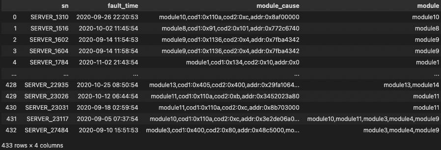
Crashdump数据
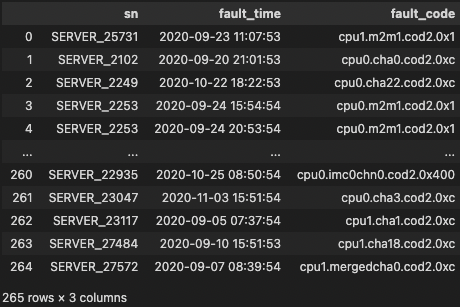

我们将进一步分解官方提供的额外数据开展挖掘工作，争取在复赛中取得较高名次

之后我们会尝试其他的文本分类模型，进一步提高F1分值

#### 5.4 总结体会

本次对大规模日志的故障诊断分析，我们小组从最前端的日志数据处理开始，之后讨论试验了不同的探索性分析，并数据化了各种因素与错误类型之间的关系。在此基础上，进行了以单词为测量基础的两种特征构建，在算法上经过讨论使用了CatBoost算法和GRU算法，通过训练最终取得了良好的效果。

本次实验提高了我们对处理海量数据的能力，增进了我们对抽象化的算法具象为处理实际数据的认识，加深了我们每个人在团队工作交流中的自我认知，在此次作业完成过程中大家受益匪浅！
